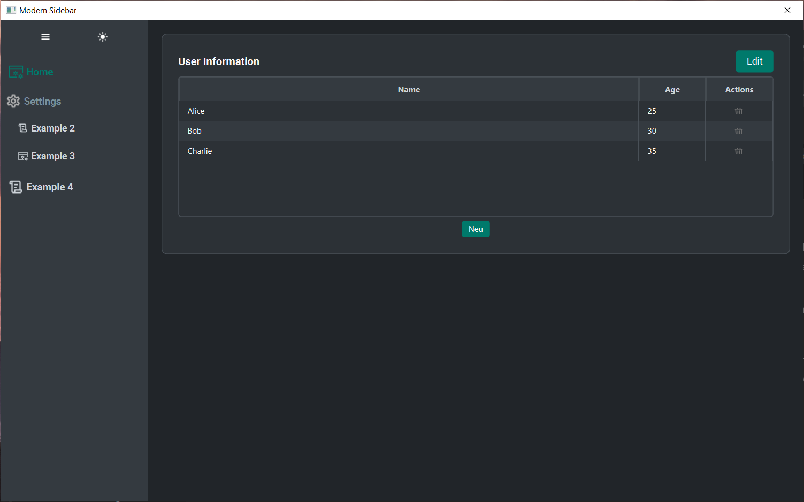
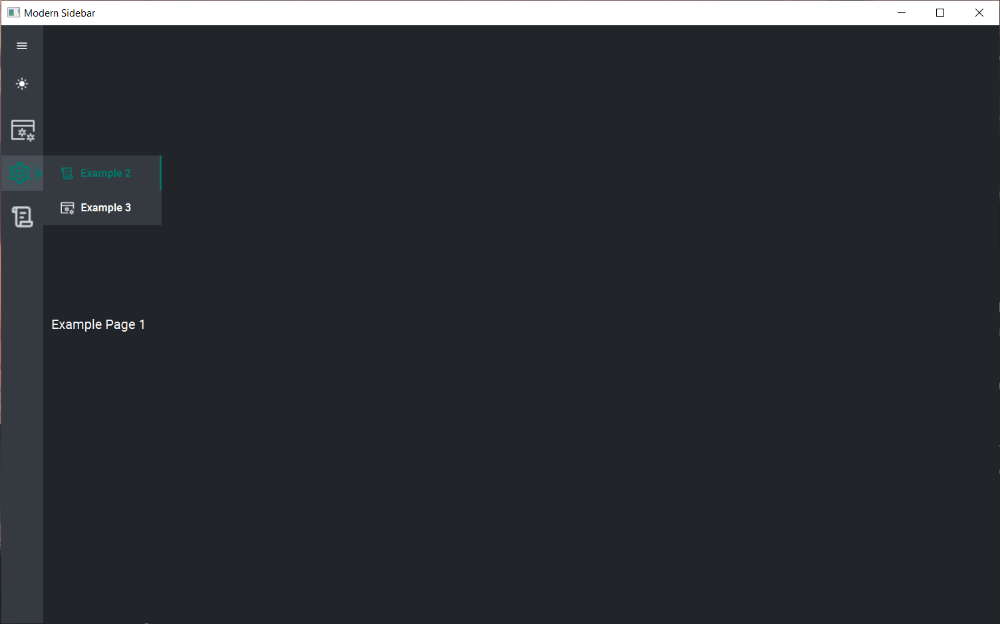

# Modern Sidebar for Pyside 6 and PyQt 6





Modern Sidebar is a custom and animated sidebar for Pyside 6 and PyQt 6. It provides a modern and user-friendly interface for navigation and interaction with your application's content.

Also it provides light and dark mode themes witch can be switched using the toggle button.

## Features

- perfect template to start your project
- Customizable sidebar layout
- Animated sidebar opening and closing
- Light and dark mode themes
- Easy integration into your application
  - You can just copy into your project folder and add the views into the lib/views folder


## Installation

Clone the repository and install the dependencies:

```bash
git clone https://github.com/Ed1ks/modernSidebarPython.git
cd modern-sidebar
pip install -r requirements.txt
```

## Price

⭐ Priceless. But if you like my work and it safed you some time please consider to give me a star on Github or [Buy me a coffee](https://buymeacoffee.com/ed1ks)